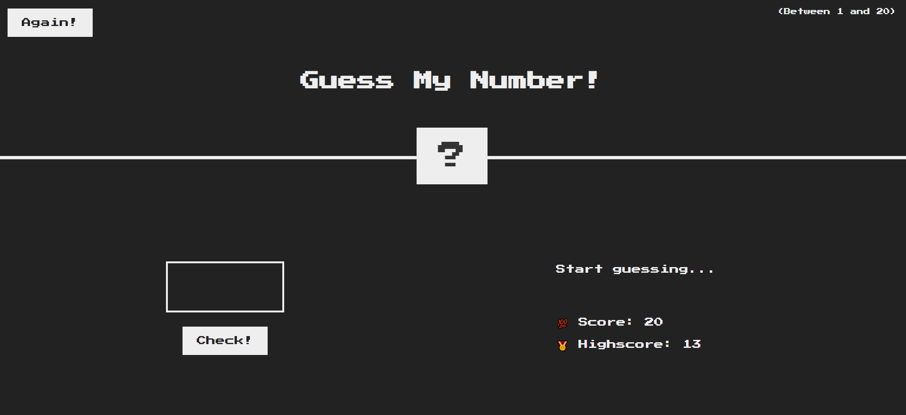
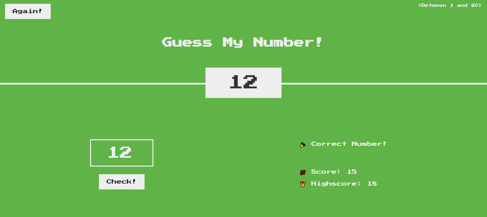

## Guess my Number!

 Jogo simples que consiste em advinhar um número secreto de 1 a 20. O jogador tem 20 tentativas e a cada falha vai reduzindo o score, caso zerar o jogador irá receber uma mensagem de que perdeu o jogo. Acertando, irá receber a mensagem de parabéns e o número secreto vai ser revelado no centro da tela. 

### Como jogar 

 Para jogar é simples, basta inserir um número no input e checar se ele está correto. Na parte direita terá um indicador se sua sugestão foi muito alta ou muito baixa. Finalizando a rodada, no Highscore será mostrado em quantas tentativas você conseguiu. E para jogar novamente, basta utilizar o botão "Play Again" na parte superior esquerda. 

  

#### Tela do vencedor 
