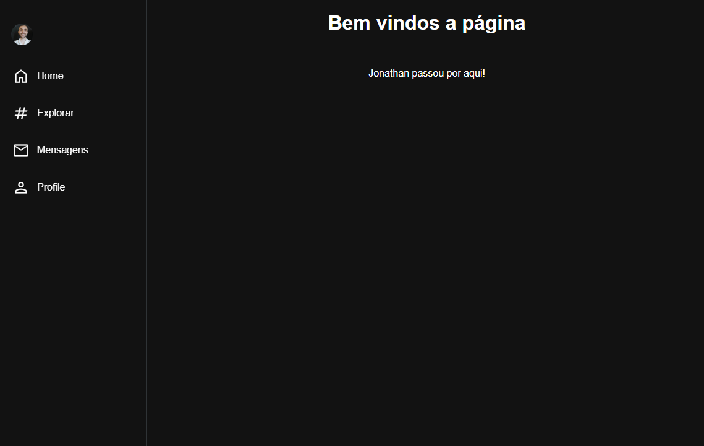
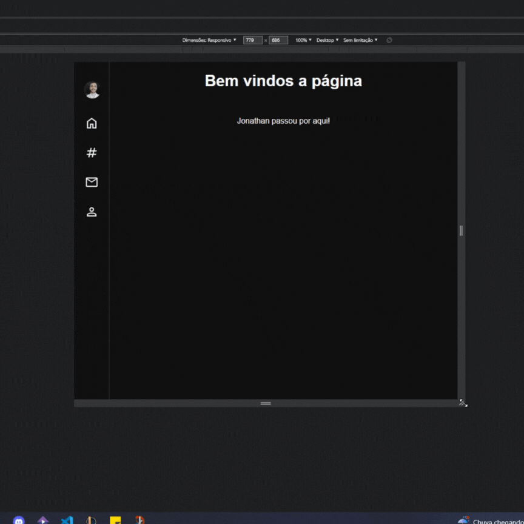
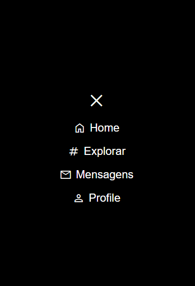

## Sidebar
- Exercício consiste em criar uma sidebar semelhante a do twitter/instagram.

- E também em criar uma transição suave na sidebar quando estiver em telas menores, focando só em mostrar os icones.

- E finalizando com um menu mobile exibindo o menu e a opção de fecha-lo.

